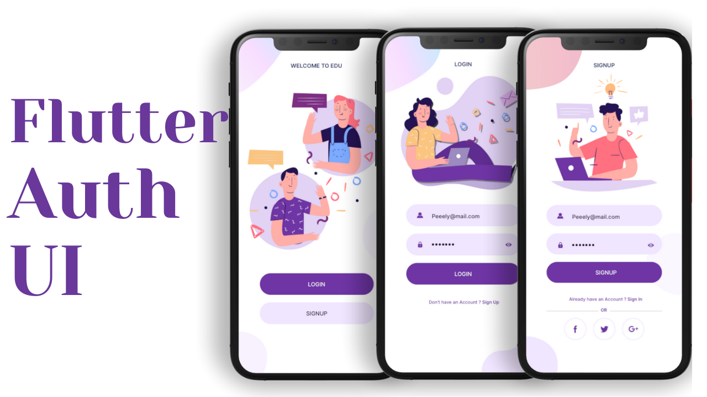

# [Flutter Auth UI](https://www.youtube.com/watch?v=ExKYjqgswJg)

Nós projetamos três telas, primeiro uma é uma tela de boas-vindas, como quando o usuário abre o aplicativo, depois ele mostra que o usuário tem duas opções se ele/ela tem uma conta, em seguida, pressione o botão de login e simplesmente o desloca para a tela de login ou se ele/ela não tem uma conta, em seguida, pressione o botão de inscrição para transferi-la para a tela de inscrição.
